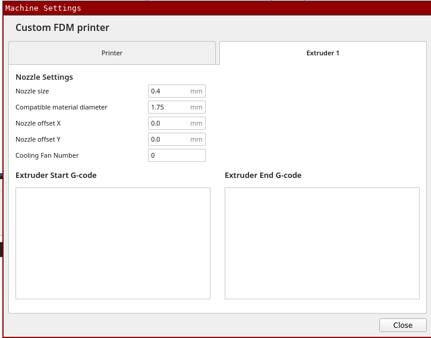
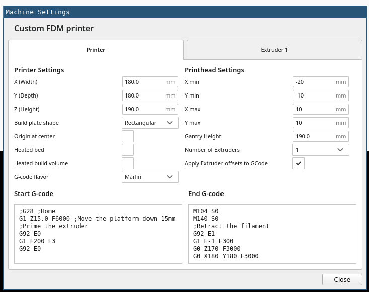

# tinyfab on cetus
This is to document my 3D printer setup

  * Tiertime Cetus MK3
  * Added real limit switches to the XYZ axes
  * Tinyfab cpu board

# Building Smoothieware
The `pt100` feature from `mvadu` is needed, else the temperature sensor in the hot-end doesn't work.

```bash
git clone git@github.com:yetifrisstlama/Smoothieware.git
cd Smoothieware
make
```

Copy the file `LPC1768/main.bin` to the sdcard calling it firmware.bin and reset.

Also copy these 2 configuration files to the SD card:

  * `config.txt`
  * `config-override`

# Building ESP3D

```bash
git clone https://github.com/luc-github/ESP3D.git -b 3.0
cd ESP3D/
vim esp3d/configuration.h

  #define SD_DEVICE    ESP_SD_NATIVE
  #define SD_DEVICE_CONNECTION  ESP_SHARED_SD
  #define ESP_FLAG_SHARED_SD_PIN 0
  #define ESP_FLAG_SHARED_SD_VALUE 0
  #define ESP_SD_CS_PIN           5

pio run -e esp8266dev
```

firmware is in `.pioenvs/esp8266dev/firmware.bin`

Default STA WIFI password is `12345678`

Once connected to the web-interface, upload this particular [index.html.gz](https://github.com/luc-github/ESP3D-WEBUI/blob/96affa6cc7af90613b54bbbd5f334cfa24f32a62/dist/printer/production/index.html.gz?raw=true) to SPIFFS.

# Cura machine settings





# See also
  * [tinyfab schematic](TFUPCPUV5R_1.pdf)
